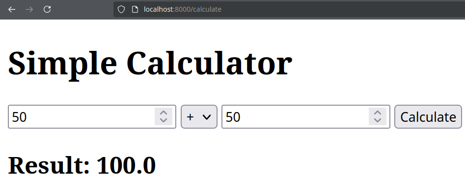

# Flask Calculator Web Application


This is a simple calculator web application built using Flask, Dockerized for easy deployment. The application allows you to perform basic arithmetic operations such as addition, subtraction, multiplication, and division.

## Prerequisites

Before you begin, ensure you have the following installed on your machine:

1. **Docker**: To build and run the Docker container.
2. **Python 3.9**: To run the application and the tests locally 
3. **Flask==2.1.2** 
4. **Werkzeug==2.0.3**
5. **Ansible** 

## Directory Structure

Your project directory should look like this:

```
calculator/
│
├── app.py
├── Dockerfile
├──.dockerignore
├──.gitignore
├── venv
├── requirements.txt
├──ansible-playbook.yml
├── test_app.py
├──.github/workflows
            └── git-action.yml
└── templates/
    └── index.html
```
## Running the Application Locally (Without Docker):
### If you prefer to run the application locally without Docker, follow these steps:
1. Create and activate a virtual environment:
```
python3 -m venv venv
source venv/bin/activate
```
2. Install Dependencies:
```
pip install -r requirements.txt
```
3. Run the Application:
```
python3 app.py
```
### The application should now be accessible at http://localhost:8000 in your web browser.

## Running Tests
```
python3 -m unittest test_app.py
```

-----
## Build & Run Docker Image:
```
docker build -t calculator-app .
docker run -p 8000:8000 calculator-app
```


## Push to Docker Hub:

#### Step 1: Tag Your Docker Image
```
docker tag calculator-app:latest emadeldin1/calculator-flask
```
#### Step 2: Login to Docker Hub
```
docker login
```
#### Step 3: Push to Docker Hub
```
docker push emadeldin1/calculator-flask:latest 
```
---------------------
## Run The application Using Ansible-playbook
#### step 1: test the proccess before building
```
ansible-playbook ansible-playbook.yml --check
```
#### Run The application
```
ansible-playbook ansible-playbook.yml
```
---------


## Github Action Steps

#### Step 1: Update your Requirements :
```
pip freeze > requirements.txt
```
#### Step 2: push to github
```
git add .
git commit -m ""
git push origin main
```


----------

-----
